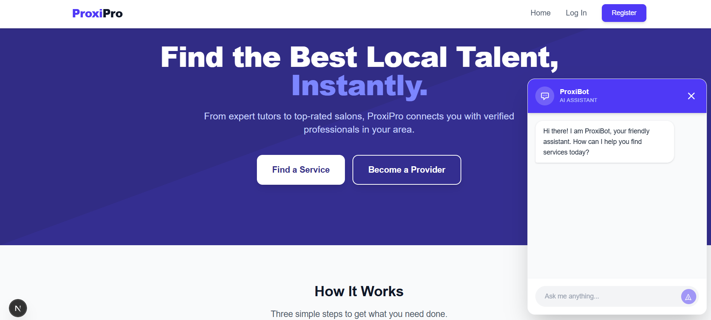
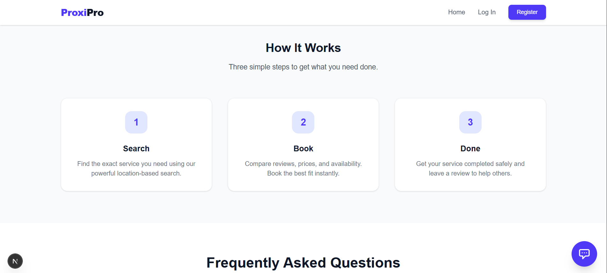
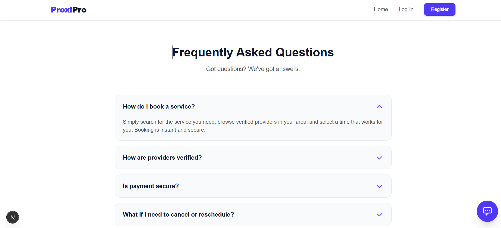
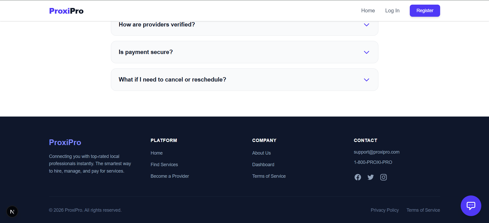
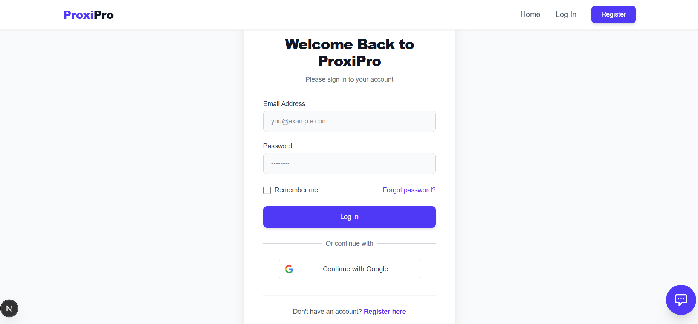
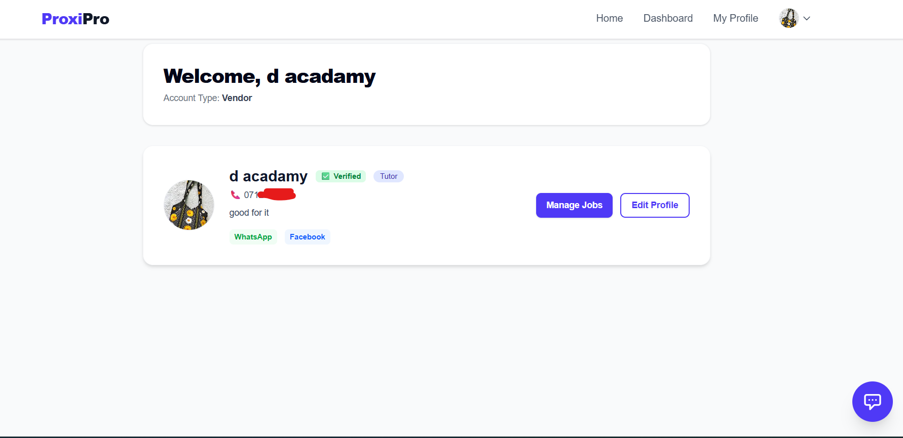
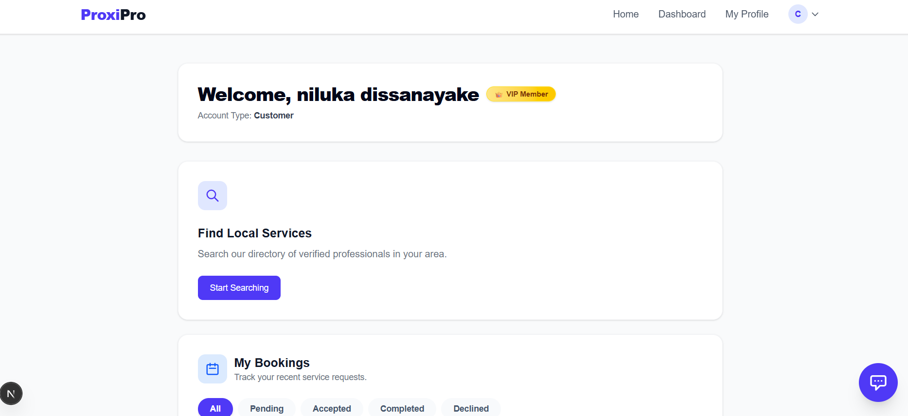
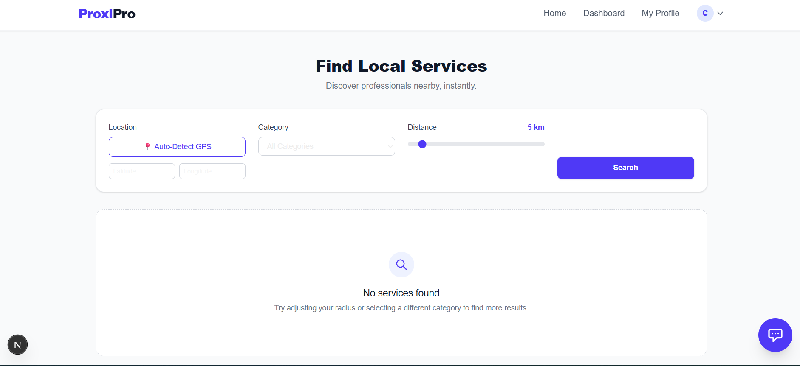
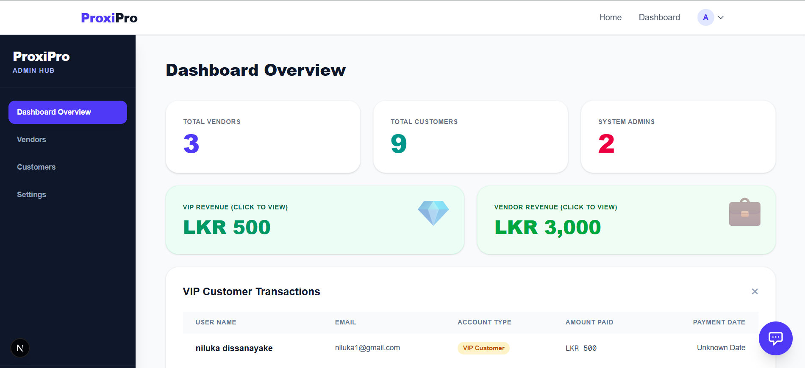
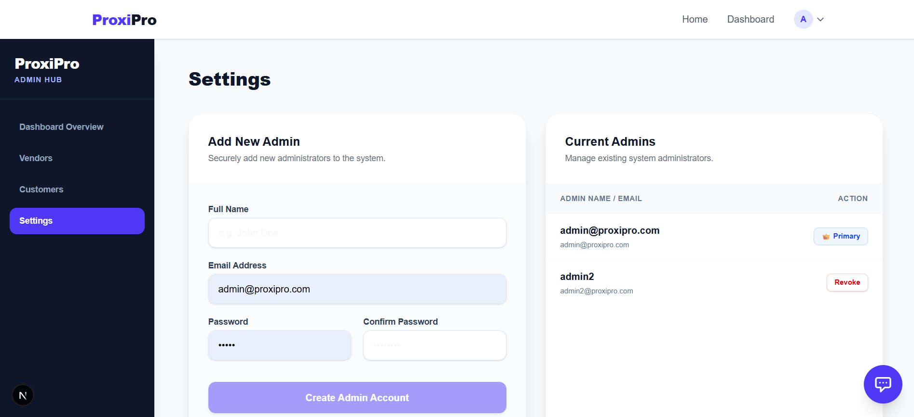

# 🚀 ProxiPro - Next-Generation Multi-Vendor Service Marketplace

ProxiPro is a modern, high-performance multi-vendor marketplace designed to seamlessly connect customers with local service providers (tutors, plumbers, salons, etc.). Built with a cutting-edge tech stack, it features intelligent location-based matchmaking, real-time AI assistance, and a robust role-based architecture.

## ✨ Key Features

* **Intelligent AI Assistant (ProxiBot):** Integrated with Google's state-of-the-art `gemini-2.5-flash` model to provide 24/7 customer support, smart vendor matchmaking, and platform guidance.
* **Geospatial Service Discovery:** Utilizes MongoDB's `2dsphere` indexes to instantly calculate distances and accurately fetch the nearest service providers based on user coordinates.
* **Optimized Conversion Funnel:** Implements a "Browse freely, Login to Act" architecture. Users can explore services globally, but contact details are securely gated behind user authentication to drive platform registrations.
* **Secure Authentication:** Seamless and secure user onboarding flow powered by Google OAuth 2.0 and JSON Web Tokens (JWT).
* **Asynchronous Backend Processing:** Engineered with Python's FastAPI for non-blocking, lightning-fast API responses and AI data handling.

## 💻 Tech Stack

**Frontend:**
* Next.js (React) - Server-side rendering & optimized routing
* Tailwind CSS - Highly responsive and modern UI styling
* TypeScript / JavaScript

**Backend:**
* Python (FastAPI) - High-performance RESTful APIs
* Uvicorn - ASGI web server

**Database & Cloud:**
* MongoDB (Motor Async Driver) - NoSQL database with Geospatial capabilities
* Google GenAI SDK - AI Chatbot processing

## ⚙️ System Architecture

1. **Client Layer:** Next.js application managing global state, routing, and responsive UI components.
2. **API Gateway:** FastAPI endpoints handling request validation, authentication checks, and routing.
3. **AI Engine:** Asynchronous communication with Google's GenAI APIs for real-time natural language processing without blocking the main event loop.
4. **Data Layer:** MongoDB collections storing multi-tier user data (Customers, Vendors, Admin) and localized geographic coordinates.

## 🛠️ Getting Started (Local Development)

Follow these steps to run ProxiPro on your local machine.

### Prerequisites
* Node.js (v18+)
* Python (v3.10+)
* MongoDB Atlas Account

### 1. Clone the Repository
git clone https://github.com/mashdias/ProxiPro.git
cd proxipro

### 2. Setup Backend (FastAPI)
cd backend
python -m venv venv
source venv/bin/activate  # On Windows use: venv\Scripts\activate
pip install -r requirements.txt

Create a `.env` file in the `backend` directory:
MONGO_URI="your_mongodb_connection_string"
JWT_SECRET="your_jwt_secret"
GEMINI_API_KEY="your_google_ai_studio_key"

Start the backend server:
uvicorn main:app --reload --port 8000

### 3. Setup Frontend (Next.js)
cd ../frontend
npm install

Create a `.env.local` file in the `frontend` directory:
NEXT_PUBLIC_API_URL="http://localhost:8000/api"

Start the development server:
npm run dev

### 4. Open Application
Navigate to `http://localhost:3000` in your browser.

## 🚀 Future Roadmap

* **Payment Gateway Integration:** Implementing PayHere to handle Vendor Subscriptions and Premium Customer tier upgrades.
* **Advanced Review System:** Allowing verified customers to rate and review vendors.

## 👨‍💻 Author

MASHDIAS
* LinkedIn: https://www.linkedin.com/in/silila-hansika-68454940a/

